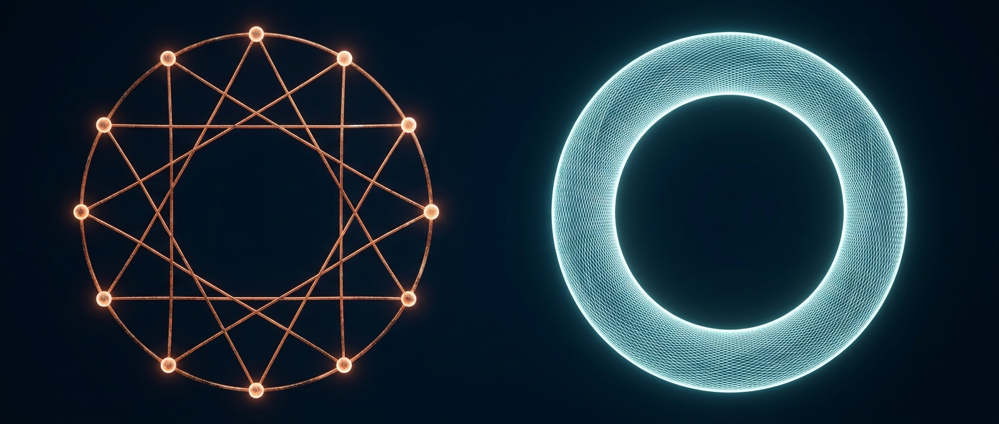
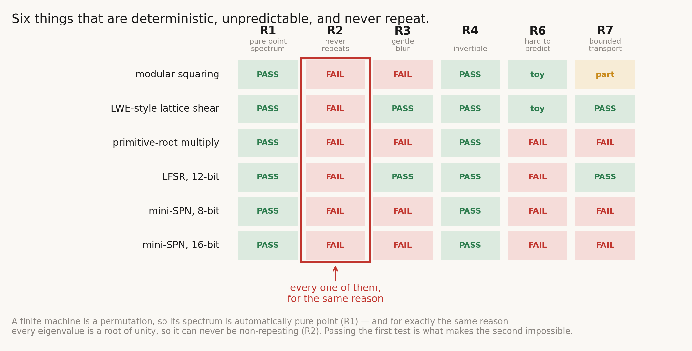
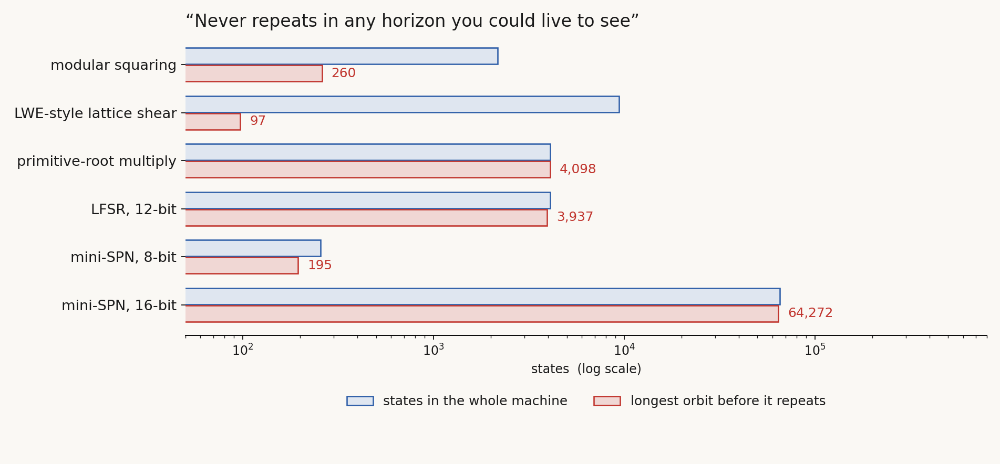

# The Crypto Bet

*Quest for Entropy #8: I went shopping for randomness in the one industry that manufactures it — and came home with a very good music box.*

## The question

Last time I built a lattice that was too perfect. It made real waves and a real particle, and it was so orderly it could never shake that particle loose. Chaos, the thing I had actually gone looking for, stayed out of reach — no quick answer, so far.

But the wish list survived. Whatever the world is made of underneath, it has to be **deterministic** — no dice anywhere. It has to look **unpredictable** from the inside, or nothing would ever surprise us. And it must **never repeat**, or everything comes around again and history is a loop.

Which sounded impossible, until I noticed there is an entire industry built on those three words. Your bank uses it. Your phone uses it right now. Cryptography makes numbers that are perfectly deterministic, pass every test for randomness anyone has thrown at them, and do not repeat within any horizon you would live to see.

A huge space, decades of work, thousands of clever people. It would be strange if it had nothing for me. So I bet on it.

## What I asked for

The one thing I did right was to write the exam before meeting the candidates. Three demands decide this story.

**It has to ring.** Strike a bell and you hear notes — steady, definite, carrying on. Hit a lump of clay and you get a thud that dies. A wave has to be built out of notes: rhythms in the machine's motion that keep going. Not thuds.

**The notes must never fall back into step.** Think of two clock hands. If one goes exactly three times faster than the other, they make the same picture over and over. Only when their speeds have no common measure — an irrational ratio — do they never repeat a shape. I need that, or the world eventually replays itself.

**And a small uncertainty must stay small.** If I am slightly unsure where something is, that unsureness should spread gently, not swallow everything in one step.

Then I went shopping. Six machines, small enough that I could look at every single state they can possibly be in:

- **Modular squaring** — squaring numbers on a clock face. The arithmetic under old public-key encryption: trivial to run, believed hard to undo.
- **A lattice shear** — the shape of scrambling behind the encryption now being standardised to survive quantum computers.
- **Primitive-root multiplication** — repeated multiplication that walks through every number before coming home. The purest long-cycle machine there is.
- **A 12-bit shift register** — the cheap classic, generating "random" bits in radios and test gear for decades.
- **Two miniature ciphers**, 8-bit and 16-bit — real cipher design in doll's-house scale: rounds, substitution boxes, the works.

Three that are believed to be one-way, one workhorse, two that are shaped like the real thing. Eight requirements written down in advance; these three are the ones that bite.

## The run

Two experiments: the exam itself, and the obvious repair.

### The trap

All six rang. Six out of six on the first demand.

That is not what failure looks like, and I enjoyed it for about ten minutes. Then I looked at *why* they passed.

A machine with a fixed amount of memory has only so many states it can be in. It is deterministic, and it never merges two states into one — so all it can do is shuffle a finite deck. And a shuffle has to come home. Follow one card: it moves, moves again, and since there are only so many places to be, sooner or later it lands where it has already been. From there it repeats forever. The deck is carved into closed loops.

Closed loops ring beautifully. That is *why* all six passed the first demand — and it is the same fact that kills the second one, because the notes of a closed loop always fall back into step. They have to. The loop comes back around.

Green straight down the first column, red straight down the second. **Passing the first test is what makes the second impossible.**

Now, this is obvious. I want to say that plainly, because it is the whole point. Of course a fixed-size machine comes back around; you can see it in a sentence. What is not obvious is how comfortable I had been with the industry's promise — *never repeats in any horizon you could live to see* — without noticing that it is a claim about **me**, not about mathematics.

So I measured it. The most cipher-like machine on my bench, the 16-bit one with all the rounds and boxes, comes back around after about 64,000 steps out of its 65,536 possible states.

Red is how far it gets before repeating; blue is the whole machine. They are nearly the same length — it uses almost everything it has, and it is still done in less than a second on a laptop. Real ciphers are astronomically bigger, and that is exactly the point: bigger makes the loop longer. It never makes the loop go away.

A cipher is a music box. Wonderfully engineered, impossible to predict if you do not know the mechanism, and playing one fixed tune forever.

### The repair, and what it cost

There is an obvious fix, and I tried it. The problem is being finite — so stop being finite. I took the best-behaved machine and bolted an **irrational turn** onto it: a rotation by an angle that never lands twice in the same place. Those are the clock hands that never repeat a shape.

It worked. The notes came apart and stopped falling back into step, to the last digit my machine can count.

And then the third demand broke. With the irrational turn bolted on, a small uncertainty stopped spreading gently and started flying apart in a straight line. I had pulled the blanket up over the notes, and my feet were sticking out at the other end. The instructions I had written for myself in advance, for exactly this outcome, said stop. So I stopped.

But look at what did the repairing. Not the cipher. The cipher was dead weight. The one thing that made the notes never come back into step was the **irrational turn** — the part I bolted on as an afterthought.

I had the ingredient in my hand and thought it was a patch. [Episode #2](https://questforentropy.substack.com/p/the-machine) presented a version of the machine that eventually gave some good results; its heartbeat is nothing but irrational turns running side by side, with no cipher underneath at all. It took a while to notice that the patch was the recipe.

## What I actually bought

Here is the thing I came away with, and it is worth more than the bet was.

**Cryptography does not make randomness. It makes ignorance.** That is not an insult — it is the job. A cipher is a fixed, knowable, perfectly determined tune, engineered so that nobody without the key can hum along. The unpredictability is not inside the machine. It lives in the gap between the machine and the person watching it.

And ignorance was never my missing ingredient. This whole quest already assumes a deterministic world with a bounded observer stuck inside it — that gap is where I think the randomness of physics comes from in the first place. I went shopping for the thing I already had.

What I actually needed was **endlessness**: something that never comes back around, not merely something that comes back around eventually. No finite machine can give me that, no matter how clever.

Two lessons came home with me. The **irrational turn**, which became the heartbeat of the first version of the machine. And the **fold** — ciphers, like chaos, are hard to reverse because they stretch and fold, over and over, and that picture became my whole account of measurement. A fold is not irreversible in itself; it is irreversible *for an observer with limits*.

Which, of course, is the same lesson as the music box. The crypto bet gave me ideas I had not initially been looking for.

## The Confession

I was hoping cryptography would hand me a solution, and I did not find one there for the machine I am building. What I did find were a couple of good ideas for later — which is not nothing, but it is not what I went in for.

Worth saying plainly: six small machines and one repair attempt is a small bench. Neither experiment came back as a clean failure; both came back "partial", and the repair genuinely worked on the half it was aimed at.

## What this does NOT claim

- Not a proof that no cryptographic construction can work as a substrate. Six machines, one repair, one checklist fixed in advance.
- Nothing here touches the security of real cryptography. These experiments measure notes and spreading. They break nothing, and are not about breaking anything.
- Nothing here is a claim about how nature works — only about what six small machines do when you hold a checklist against them.
- The closed-loop argument is well known; it is a standard fact about finite shuffles. I was checking whether the thing I hoped for could survive it.
- Irrational turns passing one test that everything else failed is a hint, not a result.

## The neighbors

The "notes of a machine" language comes from **Koopman operator theory** — studying a system through the tones of the functions on it, which turns a nonlinear problem into a linear one. The irrational repair is straight out of **KAM theory** (Kolmogorov, Arnold, Moser), where "never quite lines up" has a precise meaning. The closed-loop result is elementary group theory, in any algebra textbook: the kind of fact that is obvious in hindsight and invisible while you are excited. And the stretch-and-fold picture of why ciphers resist reversal goes back to **Shannon's** 1949 paper on confusion and diffusion, and to the horseshoe maps of dynamical systems. I did not find that connection; I walked into it.

## Run it yourself

Everything above is one command: [github.com/masteris777/quest-for-entropy-the-crypto-bet](https://github.com/masteris777/quest-for-entropy-the-crypto-bet). It rebuilds both scorecards from scratch, re-derives every loop length by taking each machine apart into its cycles, and re-fits the spreading. If a number here does not match what it prints, the number here is wrong and I will correct it in public.

The loop lengths are worth poking at. Change the modulus, watch the longest loop move — and see how hard it is to make it grow the way you would want.

## How this was made

I am a software architect who does this as a hobby, not a physicist, and I say so every time. I set the questions and make the calls; the AI builds the engines, runs the measurements, argues with me about interpretations, and writes alongside me — the models on this episode were Fable 5, Opus 5 and Sonnet 5. The project keeps a public honesty ledger of its own mistakes, and the house rule stands: the article quotes nothing its companion repo cannot re-run from scratch. Both experiments here predate part of that process, so every number above was pulled fresh from the stored results and re-derived while writing.

## Next time

Two roads closed. The lattice was too orderly to shake its own particle. Cryptography can hide a tune, but it cannot make one that never comes back around.

The lattice wrote down Einstein's energy formula by itself, and stopped one letter short of Schrödinger's. The missing letter was *i*, the imaginary number: something that packs two real quantities — a density and a flow — into one.

Can the cloud of probabilities be something more natural? A fluid?

Next time: the fluid in the wave function.

---

*Quest for Entropy is written by Marijus Masteika. Entropy was always the dark horse for me — connected to information, and maybe hiding answers to everything. That's the quest.*
